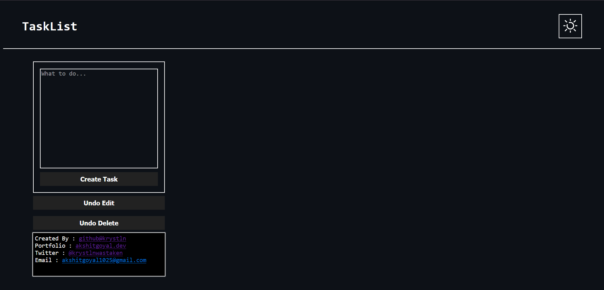
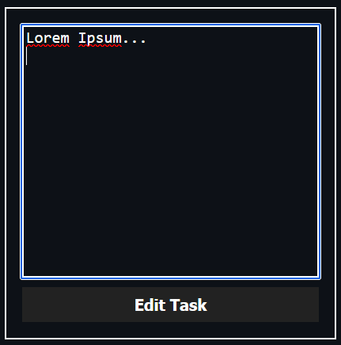
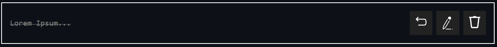

# TaskList
### A web app for task management.
###### April, 2023

Uses react hook `useState` for state management for different tasks.

## How to Use

Goto : [https://krystln.github.io/tasklist-react/](https://krystln.github.io/tasklist-react/)

At initial load you will see :

Here, an example task has already been set-up for you.\

To create a new Task, fill in the Task Creation Form and press `Create Task`
\

To edit an already existing Task, press 
This will open an editing menu within the task. You can edit fields here and press `Save` to save your changes.
\

To mark a Task for completion, press 
This will color code your task to green, indicating that the task has been completed. 
\

To undo this action, press 
This will revert task completion.\

To delete a task, press 
NOTE : A DELETED TASK CANNOT BE PRESEREVD.

